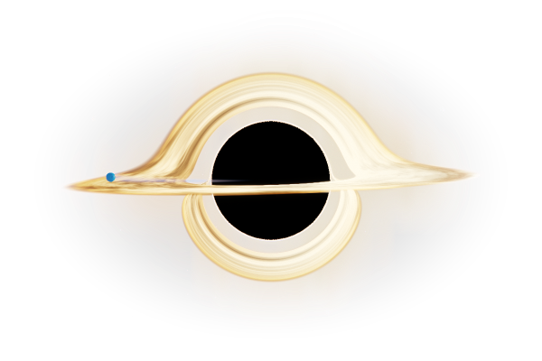

# Desktop Black Hole · Codex & DSH Status Light

English | [简体中文](README.zh-CN.md)

A small, transparent black hole for your Windows desktop, with a Zima Blue companion that can optionally show local Codex or DeepSeek Harness activity.

**Windows desktop toy · Local activity light · English / 中文 · No Python needed for the portable app**




The black hole is rendered in real time with procedural GLSL and Schwarzschild null geodesics, including a thin accretion disk, gravitational lensing, photon rings and bloom. No video or screenshot is used to fake the black-hole scene.

## Run the portable app

1. Download the Windows x64 ZIP from [Releases](https://github.com/cndotagreatagain-dev/desktop-black-hole/releases). GitHub's green **Code → Download ZIP** contains source code, not the runnable app.
2. Extract the **entire** ZIP.
3. Open **DesktopBlackHole.exe**. Python is not required.

Keep the accompanying folders beside the EXE. Windows 10/11 x64 and a graphics driver supporting OpenGL 3.3 are required. The optional desktop-background lensing feature requires Windows 10 version 2004 or later.

The app starts in **English**. Right-click → **Language / 语言** → **中文** to switch to Chinese. Your choice is remembered.

For the Chinese portable guide, see [使用说明](docs/PORTABLE.md).

## Controls

- Left-drag to move; mouse wheel to resize.
- Current source builds add **Start with Windows (current user)** to the right-click menu. It is off by default and only registers this app after you enable it. Disable it to remove the entry; after moving the app folder, toggle off and on to update the path. Windows may delay startup or disable it through Task Manager. The existing v0.1.0 ZIP predates this option.
- Right-click for quality, cursor gravity, desktop background lensing, companion, status sources and window placement.
- Choose **Always on top**, **Keep below other windows**, or disable both for ordinary window placement.
- “Keep below” is not wallpaper embedding; Windows Show Desktop may hide the widget.
- File drops provide visual feedback; the app does not move, delete or modify dropped files.
- Quality options: Standard, High (default), Cinematic. Try Standard or disable background lensing if performance is low.
- Number keys 0–9 select diagnostic views when the widget has keyboard focus; 0 restores the final scene.

## Optional activity light

The companion keeps orbiting rather than parking in place:

| Status | Appearance |
| --- | --- |
| Idle | Slow outer orbit |
| Busy | Closer orbit above the disk, five seconds per revolution, brighter breathing and a curved tail |
| Disconnected / unconfirmed | Dim outer orbit; never presented as confirmed idle |

Enable the companion and select sources from the right-click menu. The visual toy works without Codex, DSH, an API key or model calls.

Codex integration monitors local instances that have loaded the status hooks, not cloud tasks or every possible session automatically. In the portable app, use **Status sources → Install Codex integration**, then review the commands in Codex's **/hooks** screen before trusting them and restarting Codex.

DSH is separate, optional and disabled by default. **Enabling its checkbox does not load the plugin.** In current source builds, open **Status sources → DSH setup guide** for this computer's module path and a copyable configuration snippet. The guide does not read or modify DSH configuration. The published v0.1.0 app has no setup dialog: follow the [English DSH guide](integrations/dsh-status/README.en.md) ([中文](integrations/dsh-status/README.md)) to add one persistent profile entry. Keep other entries and do not load the same plugin twice. A real Windows web-profile connection has been verified; broader host/version testing remains limited.

## Privacy and limitations

Status monitoring uses local files and does not call a model or consume tokens. Small status records are checked every two seconds; unchanged records are cached. Codex recovery checks read only bounded log tails for known local sources when needed. This is an activity indicator, not an exact distinction between thinking, streaming text and input availability.

Desktop background lensing is **enabled on first normal launch** and reads the screen behind the widget into memory; the production effect does not record or upload those frames. Cursor gravity captures the cursor image for its visual effect. Both effects can be disabled independently. Developer capture tools can explicitly save screenshots and machine paths; do not share their raw output or startup logs without review.

Status records are not chat transcripts, but may contain identifiers and local transcript references. The Codex installer separately reads and backs up hook configuration. Never upload personal Codex/DSH folders, configuration, backups or state files. See [publication safety notes](docs/PRIVACY.md).

The Windows executable is currently unsigned. SmartScreen or antivirus warnings are possible; no universal “never flagged” guarantee is made. ARM Windows, all GPUs, virtual machines and remote-desktop configurations have not been validated.

## Run from source

Python 3.11 or newer:

```powershell
py -m venv .venv
.\.venv\Scripts\python.exe -m pip install -r requirements.txt
.\.venv\Scripts\python.exe desktop_black_hole.py
```

Use the environment's pythonw.exe with launcher.pyw to launch without a console window.

## Tests and packaging

See [tested configurations and results](docs/TESTING.md) for dated results and validation limits.

```powershell
.\.venv\Scripts\python.exe -m pip install -r requirements-dev.txt
.\.venv\Scripts\python.exe -m pytest tests -q
node --test integrations/dsh-status/status.test.mjs
```

For a reproducible Windows build, install requirements-build.txt in a dedicated environment, then run:

```powershell
python tools/build_release.py --output dist/my-release
```

Use a new output directory; the builder preserves previous releases. Source and local integration assets are selected using the reviewed `release-files.txt` allowlist, not arbitrary matching files. Linked source inputs are rejected. Review any manifest change before publishing. The portable distribution uses a folder bundle rather than a self-extracting single EXE.

## Project layout

- desktop_black_hole.py: desktop window, input and rendering integration.
- gargantua_scene_shader.py: black-hole scene and ray integration.
- companion.py: activity-dependent companion motion.
- ui_language.py: English and Chinese UI presentation.
- codex_status.py / codex_status_bridge.py: local Codex activity.
- dsh_status.py / integrations/dsh-status/: optional DSH integration.
- tests/ and tools/: regression tests, rendering checks and packaging utilities.

Local backups, raw development captures, personal state/configuration and build outputs are not publication inputs. `.gitignore` is not a privacy scanner: review the exact files and archive before upload.

## Third-party notices

This project's own code is available under the [MIT License](LICENSE). See [third-party notices](docs/THIRD_PARTY_NOTICES.md) and vendor-licenses/ for dependency licenses, which remain unchanged.
